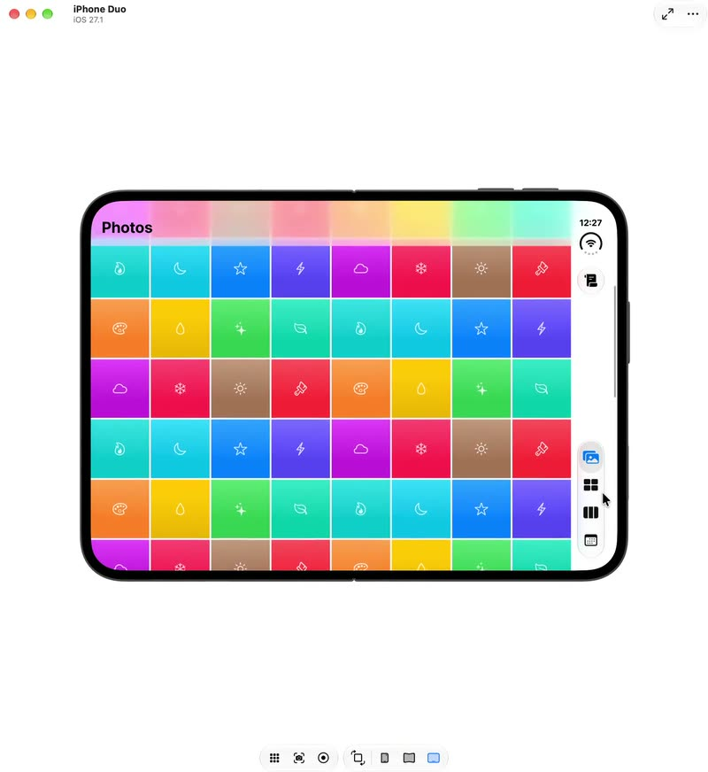

# FoldableGridView

A grid view that understands folds.

[](Resources/demo.mp4)

Rows and grids that keep off the crease of a foldable, such as the iPhone Duo. The package has no
dependencies and supports iOS 18, macOS 15 and visionOS 2 and later.

On a foldable that's partly open, a 40pt fold runs through the screen:
- **Book posture:** the device is on its side and the fold runs down the screen. A plain `HStack` or
  `LazyVGrid` divides the width evenly, so the cell nearest the middle ends up bent over the crease.
- **Tabletop posture:** the device is propped up and the fold runs across the screen. Scrolling rows
  pass over it, and whichever row stops there is cut in half.

FoldableGrid's views lay out exactly as they would anyway until a fold runs through them. Then they
part around it.

The fold APIs these views use are iOS 27.1 only, and FoldableGrid checks for them itself. On an
older system, a device that doesn't fold, a Mac or a Vision Pro, everything lays out as if there
were no fold.

## Use Swift Package Manager

```swift
dependencies: [
    .package(
        url: "https://github.com/BenjaminBriggs/FoldableGridView.git",
        .upToNextMinor(from: "0.1.0")
    ),
],
targets: [
    .target(
        name: "MyApp",
        dependencies: [
            .product(name: "FoldableGrid", package: "FoldableGridView"),
        ]
    ),
]
```

SwiftPM names a package after its repository, so the `package:` above is `FoldableGridView`. The
product and the module are `FoldableGrid`:

```swift
import FoldableGrid
```

## What's in it
| | Use it for | Instead of |
|---|---|---|
| `FoldableRow` | a row of equal cells: a calendar week, a bar chart, a row of buttons | `HStack` of `.frame(maxWidth: .infinity)` cells |
| `FoldableGrid` | cards, tiles, photos | `LazyVGrid` |
| `.foldGeometry($binding)` | your own layout that needs to know where the fold is | `onGeometryChange` |

### FoldableRow

```swift
FoldableRow(spacing: 4) {                   // one week of a month calendar
    ForEach(week) { day in
        DayCell(day)
    }
}
```

In book posture, the cells before the fold share the leading half and the rest share the trailing
half. The two halves are rarely equal, because a camera column takes one edge, so each side gets the
share of cells its width earns. Each side's cells are equal among themselves. Cells can stand as
close to the fold as its 40pt band, and every row of a calendar parts at the same place, so its
columns stay lined up. Anything a background draws behind the row runs on across the fold.
`FoldableRow` lays out with the width it is actually given, so it is right at every moment of a
rotation.

### FoldableGrid

```swift
ScrollView {
    FoldableGrid(
        columns: .adaptive(minimum: 320),     // or .count(2)
        spacing: 12,
        rowSpacing: 12
    ) {
        ForEach(cards) { card in
            CardView(card)
        }
    }
    .padding()
}
```

Unfolded, it builds the same `GridItem`s you'd write yourself. In book posture, each half gets its
own columns, sized to that half. The gap between the halves is the fold plus the **margins** its
region asks for, 20pt each side, so no card hugs the crease. With `.count(n)`, the columns are
shared between the halves by their widths.

The folded columns are flexible up to the width worked out for them, never fixed at it. During a
rotation, the measured width passes through values the screen never settles on. Fixed columns built
from one of those made the grid that wide, the grid's frame reported the width back, and it stayed
wider than the screen. Flexible columns fit the width they're offered, so the next measurement
corrects them.

#### Scrolling sideways: `FoldableGrid(rows:)`

```swift
ScrollView(.horizontal) {
    FoldableGrid(
        rows: .adaptive(minimum: 150),       // or .count(2)
        spacing: 8,                          // between rows
        columnSpacing: 8                     // between columns
    ) {
        ForEach(tiles) { tile in
            TileView(tile)
                .frame(width: 150)
        }
    }
}
```

This is the same grid turned on its side, built on `LazyHGrid`. The two folds swap jobs:
- **Tabletop**, with the fold across the screen, splits its rows. The rows above the fold and the
  rows below each get their own heights, and the fold and its margins are the gap.
- **Book**, with the fold down the screen, is the one its columns scroll past. With `crossing:
  .flow` they part around it when scrolling comes to rest, exactly as rows do in a vertical grid.

The rows are fixed at their worked-out heights, not flexible like a vertical grid's columns. Given
flexible rows, `LazyHGrid` shared out the height differently from `LazyVGrid`, and on the Duo the
gap landed 40pt above the fold.

#### Lines across a fold: `crossing: .flow`

```swift
FoldableGrid(
    columns: .adaptive(minimum: 104),
    spacing: 3,
    rowSpacing: 3,
    crossing: .flow
) {
    ForEach(photos) { photo in
        PhotoTile(photo)
    }
}
```

By default (`.scroll`), rows scroll over a fold that runs across the grid, like any scrolling
content. With `.flow`:
- **While scrolling**, it's the same plain grid. Any gap closes smoothly as soon as the grid moves.
- **When scrolling comes to rest**, the rows part around the fold with a spring. The row the fold
  would cut goes to whichever side most of it is on. If it's mostly above, it and the rows above it
  move up just enough; if mostly below, it and the rows below move down past the fold. The fold
  falls in the gap, and rows never overlap one another.

"At rest" means the grid's position in the window hasn't changed for 120ms. The parting is only
drawn, so it never moves the grid and can't set itself off again. It's a visual effect on each cell,
reaching your cells through `ForEach(subviews:)`, which is why the floor is iOS 18. A modifier put
on your `ForEach` from outside the grid doesn't reliably reach each cell of a lazy grid. On the Duo,
one collapsed the grid to a single column and another moved nothing. The grid adds room at its end
for the rows it moves down.

Use it for grids of **equal-height rows**, such as photos and tiles, where a row cut by the crease
reads as broken. Leave it off for grids whose rows vary. The math is `FoldMath.flowShift`. The tests
check it at every scroll position, half a point apart: rows never overlap, and at rest no row is on
the fold.

### foldGeometry

```swift
@State private var fold = FoldGeometry()

MyLayout(gap: fold.clearance)
    .foldGeometry($fold)
```

`FoldGeometry` gives:
- `width`
- `band`: the fold itself, when it runs **down** the view with room on both sides.
- `clearance`: the band plus its margins.
- `leadingHalf` and `trailingHalf`: the widths either side of the clearance.
- `usableWidth`
- `across`: a fold running **across** the view, with its margins, in *window* coordinates. A
  scrolling row compares its own window position against this.

Measure with this modifier, not with `onGeometryChange`. Folding changes neither a view's size nor
its position, so an `onGeometryChange` transform never re-reads the fold, and the layout keeps
whatever posture the view appeared in. `.foldGeometry` measures with a `GeometryReader` in the
background. That proposes nothing, so layout is unchanged, and its body re-runs when the fold's
region changes.

Measure the width a view is **offered**, not a view whose width depends on the result.
`FoldableGrid` measures a full-width frame around its grid for this reason.
